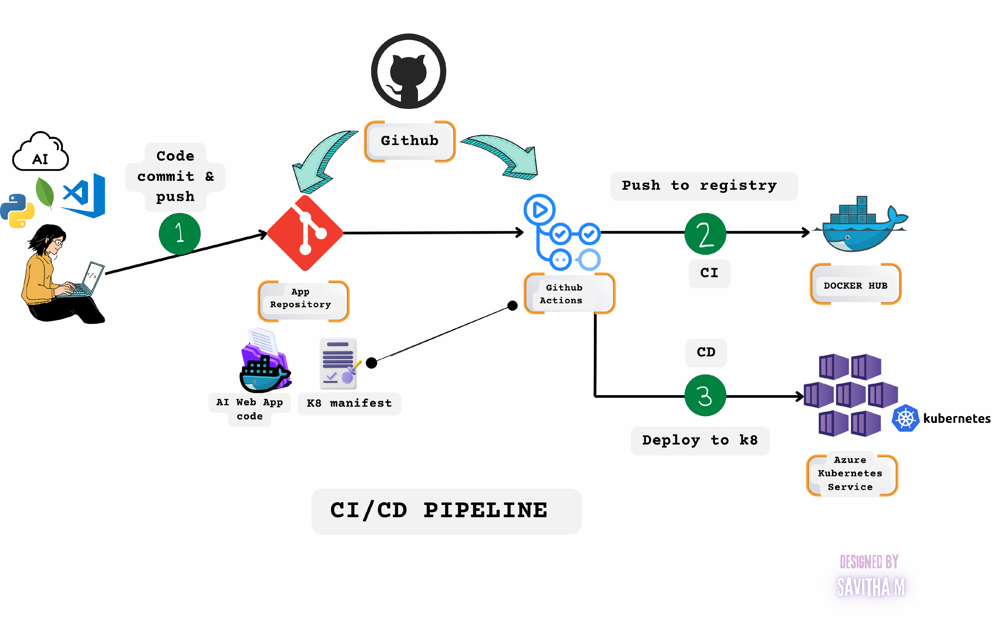

# AI WebApp for Sentiment Analysis

This is a simple AI-based web application built with Flask that performs sentiment analysis on user input text using the TextBlob library. The application is containerized using Docker and can be deployed using Kubernetes or other cloud services.

## Features
- Sentiment analysis of user input text (Positive, Negative, Neutral).
- Dockerized for easy deployment.
- CI/CD pipeline using GitHub Actions to build and push Docker images to Docker Hub.
- Deployable to Kubernetes or cloud platforms like AWS ECS or Azure ACI.



## Requirements

- Python 3.9+
- Docker
- Kubernetes ie AKS
- Azure cli, Azure cloud account 
- Git, Github

## Setup

### Clone the Repository

```bash
git clone https://github.com/yourusername/ai-webapp.git
cd ai-webapp

